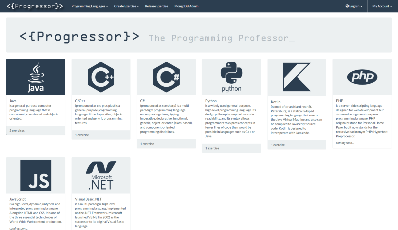
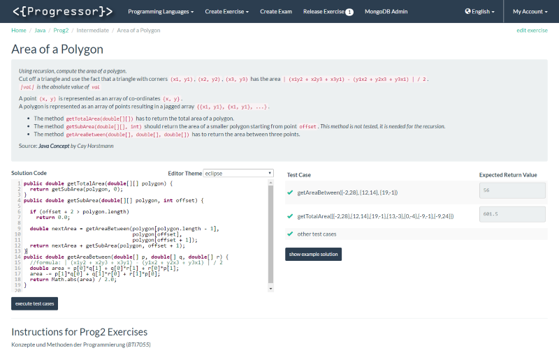
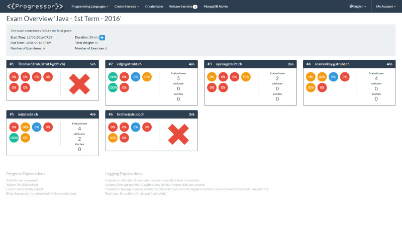
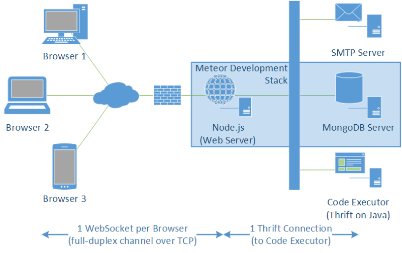

# Progressor - Meteor

This is the runnable component of the project **Progressor - The Programming Professor**.
It contains both the web application and a compiled [**Executor**](https://github.com/Progressor/ProgressorExecutor) JAR.

## Deployment & Installation

These instructions are written for *Ubuntu* 16.04.1 LTS.

### Prepare the Server

1. Install [*Docker*](https://www.docker.com/) by executing `curl -sSL https://get.docker.com/ | sh` on the server.

### On Your Development Machine

1. [Install Meteor](https://www.meteor.com/install)
1. Install [*meteor-up (mup)*](https://www.npmjs.com/package/mup) globally: `npm install --global mup`
1. Clone this repository or navigate to the folder where you cloned it.
1. Deploy the [*Meteor*](https://www.meteor.com/) web application to the server. _(Instructions adapted from meteor-up documentation.)_
   1. Configure your server(s) including usernames and passwords in `.deploy/mup.js` as instructed.
   1. Configure the application using `private/config.json` and `private/secret.json` as instructed.
   1. Go to `.deploy` and set up the server by executing `mup setup`
   1. After the setup finished, deploy the web application and the [*MongoDB*](https://www.mongodb.org/) database by executing `mup deploy`
   * **Additional Information**
     * The user you want to use to deploy **Progressor** to the server needs to be in the `docker` and `sudo` groups and have `NOPASSWD` enabled.
     * If you want to re-deploy the application without the database, you can remove the servers from `module.exports.mongo.servers` in `.deploy/mup.js`.
     * More information about *mup* can be found in the official [*meteor-up documentation*](https://github.com/kadirahq/meteor-up/blob/master/README.md).
     * More information about the configuration of **Progressor** can be found in the [advanced configuration options](doc/MeteorConfig.md)

### Executor

You need to run the [**Executor**](https://github.com/Progressor/ProgressorExecutor) to be able to solve exercises.

* You can either clone the repository and build the project yourself
* or simply use the [*JAR* file](bin/ProgressorExecutor.jar) included in the directory `bin`.
  * In this case, run the **Executor** with a working directory outside the *Meteor* projects,
    otherwise *Meteor* will recognize the files temporarily created and continuously restart the server.

## Introduction

This repository contains a reactive [*Meteor*](https://www.meteor.com/) web application.

*Meteor* is an app platform.
Web application run on a [*Node.js*](https://nodejs.org/) web server and use a [*MongoDB*](https://www.mongodb.org/) document-oriented database.

Note: *Meteor* applications require activated *JavaScript* on the client side (in the web browser) or nothing is displayed.

### Background

This project **Progressor - The Programming Professor** was started by three BSc students at the
[*Bern University of Applied Sciences'*](http://www.ti.bfh.ch/en/) (BUAS / [@bfh](https://github.com/bfh))
[*Computer Perception & Virtual Reality Lab*](https://www.cpvrlab.ti.bfh.ch/) ([@cpvrLab](https://github.com/cpvrLab)).

It has since been provided as open-source in order to encourage other educational institutions, enterprises and individuals to get involved and set up their own installation.

### Features

**Progressor** offers two basic features.

* You can create and solve exercises on your own and improve your programming skills.
* Or you can create examinations for your students to take and evaluate their achievements.

|                    Example Examination                   |            Student Examination Dashboard           |
|:--------------------------------------------------------:|:--------------------------------------------------:|
|  |  |

### Architecture

The system is composed of two components.

1. The *Meteor* web application that runs on a *Node.js* web server and uses a *MongoDB* database.
2. The **Executor**, which is a seperate *Java* application that communicates with the web application using *Apache Thrift* and executed the code fragments entered by the users.

